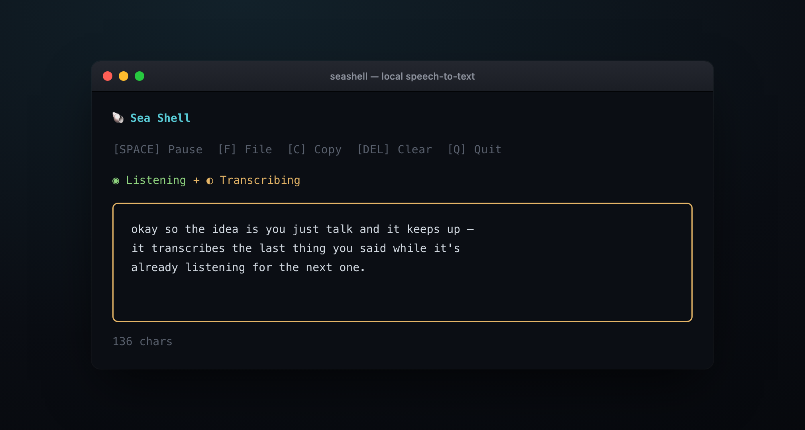

# Sea Shell

Local speech-to-text that runs entirely on your Mac. No cloud, no API keys, no latency.

Uses [whisper.cpp](https://github.com/ggerganov/whisper.cpp) with Metal GPU acceleration for fast transcription.



## Features

- **Always listening** - Auto-detects when you start/stop speaking
- **Never misses speech** - Concurrent architecture transcribes while still listening
- **Transcribe audio files** - Drag-and-drop a file onto the window, press `F` for a file picker, or run `seashell file.mp3` — wav, mp3, ogg, flac and more (auto-converted)
- **30-second chunking** - Long recordings are automatically split for faster transcription
- **Pause/resume** - Space to pause, transcribes captured audio before pausing
- **Copy to clipboard** - Press C to copy transcript
- **GPU accelerated** - Uses Apple Metal for fast inference

## Requirements

- macOS (Apple Silicon recommended)
- [Bun](https://bun.sh) - JavaScript runtime
- sox - Audio recording (`brew install sox`)
- cmake - For building whisper.cpp (`brew install cmake`)
- git - For cloning whisper.cpp

## Installation

```bash
# Clone the repo
git clone https://github.com/stupart/seashell.git
cd seashell

# Run the installer
chmod +x install.sh
./install.sh
```

The installer will:
1. Build whisper.cpp with Metal support
2. Download the Whisper large-v3-turbo model (547MB)
3. Download the Silero VAD model
4. Install dependencies
5. Create global `seashell` command

## Usage

```bash
seashell
```

### Controls

| Key | Action |
|-----|--------|
| `Space` | Pause/Resume |
| `F` | Transcribe an audio file (opens a file picker) |
| `C` | Copy transcript to clipboard |
| `Delete` | Clear transcript |
| `Q` or `Esc` | Quit |

### Transcribe a file

Got an existing recording? seashell transcribes files too — no mic required:

```bash
seashell interview.m4a              # prints the transcript to stdout
seashell voicmemo.mp3 meeting.wav   # transcribe several, in order
```

Supported out of the box: wav, mp3, ogg, flac — anything else is auto-converted via `afconvert` first. Because it writes to stdout, it pipes: `seashell talk.mp3 > talk.txt`.

Or do it live from inside the TUI: **drag an audio file from Finder onto the window** (its path pastes in and transcribes), or press **`F`** for a native file picker. The mic pauses while the file transcribes, shows progress, and resumes listening when it's done.

## How It Works

1. **sox** listens for voice activity (1.5% threshold)
2. When speech is detected, recording begins
3. After 2 seconds of silence (or 30 seconds max), recording stops
4. **whisper.cpp** transcribes the audio using GPU
5. A new listener starts immediately (concurrent with transcription)
6. Transcribed text appears in the terminal

## Models

- **Whisper large-v3-turbo-q5_0** - Main transcription model (547MB, quantized)
- **Silero VAD v6.2.0** - Voice activity detection

## License

MIT

---

Sea Shell is the local-first STT engine behind [conch](https://github.com/stupart/conch), a hands-free voice loop for Claude Code.

A small open experiment from [Blueprint Studio](https://blueprintstudio.ai) — we build AI products that feel good to use.
