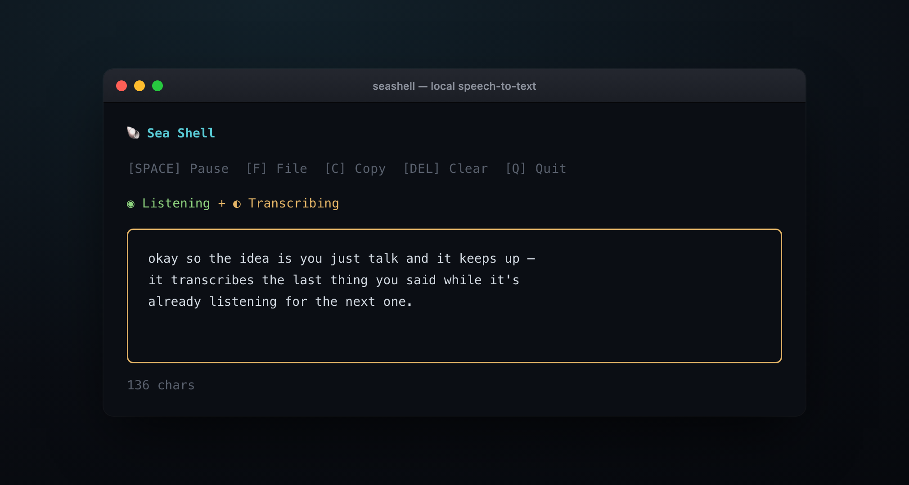

# Sea Shell

Local-first speech-to-text for audio, video, live microphone sessions, speaker
diarization, subtitles, and a durable transcript library on macOS.

Sea Shell uses [whisper.cpp](https://github.com/ggerganov/whisper.cpp) with
Metal acceleration. File and live transcription stay on your machine. Optional
speaker diarization needs a Hugging Face token for its first gated model
download; inference remains local afterward.



## What it does

- Transcribes WAV, MP3, FLAC, OGG, Opus, M4A, AAC, MP4, MOV, M4V, MKV, and
  WebM when the installed FFmpeg build supports their codecs.
- Extracts audio streams from video and prepares deterministic 16 kHz PCM for
  Whisper.
- Produces plain text, timestamped text, speaker-aware text, JSON, SRT, and
  WebVTT without rerunning transcription for each rendering.
- Saves successful file and live transcripts to a readable local folder.
- Lets you rename anonymous diarization clusters such as `SPEAKER_00` to human
  names without retranscribing.
- Provides a two-pane terminal UI for live capture, imports, search, history,
  speaker labels, timestamps, and exports.
- Keeps command output clean for shell pipelines and AI agents.

## Requirements

- macOS; Apple Silicon is recommended
- [Bun](https://bun.sh)
- FFmpeg and ffprobe for media inspection and audio extraction
- SoX for live microphone capture
- CMake and Git for building whisper.cpp

Install the system dependencies with Homebrew:

```bash
brew install ffmpeg sox cmake git
```

Speaker diarization additionally needs Python 3.10+ (3.12 recommended) and
the Python packages described under [Speaker diarization](#speaker-diarization).

## Installation

```bash
git clone https://github.com/stupart/seashell.git
cd seashell
chmod +x install.sh
./install.sh
seashell doctor
```

The installer builds whisper.cpp with Metal, downloads the Whisper
large-v3-turbo and Silero VAD models, installs Bun dependencies, and creates a
global `seashell` command.

## Quick start

Open the live transcription and library TUI:

```bash
seashell
```

Transcribe audio or video while preserving the original plain-text shortcut:

```bash
seashell interview.m4a
seashell product-demo.mp4
seashell transcribe meeting.mov --timestamps
seashell transcribe meeting.mov --speakers
seashell transcribe meeting.mov --timestamps --speakers
```

Create subtitle or structured output:

```bash
seashell transcribe demo.mp4 --format srt --output demo.srt
seashell transcribe demo.mp4 --format vtt > demo.vtt
seashell transcribe meeting.mp4 --speakers --format json > meeting.json
seashell transcribe meeting.mp4 --speakers --format srt > meeting.srt
```

Progress and save locations are written to stderr. Transcript content is the
only data written to stdout, so piping remains reliable.

## Terminal UI

On wide terminals, the left pane contains Live, Import, and saved transcripts
while the right pane shows the selected transcript. Saved items include their
date, duration, and speaker count. Terminals narrower than 100 columns switch to
a single-pane library/reader flow so timestamps, speaker labels, and wrapped
transcript text keep their alignment at a standard `80x24` size.

| Key | Action |
| --- | --- |
| `Tab` | Switch between library and transcript panes |
| `↑`/`↓` or `J`/`K` | Navigate the focused pane |
| `Enter` | Open the selected library item |
| `Esc` | Return to the library in the compact reader; close a prompt or help |
| `/` | Search saved titles, source names, speaker names, and transcript text |
| `L` | Return to live transcription |
| `Space` | Pause/resume live microphone capture |
| `F` | Import audio or video |
| `Shift+F` | Import and run speaker diarization |
| `T` | Toggle timestamp presentation |
| `S` | Toggle speaker presentation |
| `[` / `]` | Select a speaker label |
| `R` | Rename the selected speaker |
| `E` | Export as SRT, WebVTT, text, or JSON |
| `C` | Copy the current rendering |
| `O` | Open the transcript folder in Finder |
| `D` | Move a saved transcript to recoverable `_Trash` after confirmation |
| `Delete` | Start a fresh live transcript |
| `?` | Show contextual keyboard help |
| `Q` | Quit from any normal view |

In the compact library, `Esc` also quits. The footer intentionally shows only
the commands relevant to the active pane; press `?` for the complete key map.

Drag-and-drop also accepts absolute audio or video paths. The microphone pauses
while an import runs and resumes afterward.

## Transcript library

Successful transcriptions save by default to:

```text
~/Documents/Sea Shell/Transcripts/
└── 2026-08-06/
    └── product-interview--20260806143000-a1b2c3d4/
        ├── transcript.json
        ├── transcript.txt
        ├── transcript.srt   # after SRT export
        └── transcript.vtt   # after WebVTT export
```

`transcript.json` is authoritative. Text and subtitle files are derived views.
The original media is never copied into the library; its local path and media
metadata are recorded. Listings are rebuilt by scanning transcript folders, so
there is no irreplaceable database or index.

Use `--no-save` for an ephemeral command or `--library-dir` to override the
destination:

```bash
seashell talk.mp3 --no-save
seashell talk.mp3 --library-dir ./project-transcripts
```

Library commands:

```bash
seashell library list
seashell library list --json
seashell library search "launch notes" --json
seashell library show <id> --timestamps --speakers
seashell library show <id> --format json
seashell library export <id> --format srt
seashell library speakers <id> set SPEAKER_00 "Tyler"
seashell library open <id>
seashell library trash <id> --confirm
```

Trash is recoverable inside `<library>/_Trash`; Sea Shell does not permanently
delete records from its TUI or CLI.

## Canonical transcript schema

Every record retains timestamps whether or not the selected text view displays
them. Speaker IDs remain stable, while labels are editable:

```json
{
  "schemaVersion": 1,
  "id": "20260806143000-a1b2c3d4",
  "title": "Product interview",
  "createdAt": "2026-08-06T14:30:00.000Z",
  "updatedAt": "2026-08-06T14:32:10.000Z",
  "source": {
    "path": "/Users/me/Movies/interview.mp4",
    "filename": "interview.mp4",
    "duration": 130.4,
    "format": "mov,mp4,m4a,3gp,3g2,mj2",
    "audioStreamIndex": 1,
    "channels": 2
  },
  "transcript": [
    {
      "start": 0.42,
      "end": 2.18,
      "speaker": "SPEAKER_00",
      "text": "Let's ship it."
    }
  ],
  "speakers": [
    { "id": "SPEAKER_00", "label": "Tyler" }
  ]
}
```

Non-diarized segments omit `speaker`. Optional `summary`, `decisions`, and
`action_items` fields remain available for provider-neutral enrichment.

## Media preparation

Sea Shell uses ffprobe to enumerate audio streams and reject media without
audio. FFmpeg selects one stream, ignores video, decodes its codec, resamples
it, and writes 16 kHz signed PCM WAV for Whisper. This is not loudness
normalization.

Ordinary transcription produces mono PCM. Speaker diarization preserves source
channels, and `--channel-roles` can assign explicit channel identity. When a
container has multiple audio tracks, inspect them with ffprobe and select one by
its absolute stream index:

```bash
ffprobe -v error -select_streams a -show_streams movie.mkv
seashell transcribe movie.mkv --audio-stream 3
```

## Speaker diarization

Sea Shell uses the local
[`pyannote/speaker-diarization-community-1`](https://huggingface.co/pyannote/speaker-diarization-community-1)
pipeline. Diarization creates recording-local clusters; it does not inherently
know human identities. Rename those clusters later through the TUI or library
CLI.

One-time setup:

```bash
brew install python@3.12 ffmpeg
python3.12 -m venv .venv-diarization
source .venv-diarization/bin/activate
python -m pip install -r scripts/requirements-diarization.txt
```

Then accept the Community-1 model conditions, create a Hugging Face read token,
and use it for the first model download:

```bash
export HF_TOKEN=hf_your_read_token
seashell transcribe meeting.m4a --speakers --format json
```

Later runs use the Hugging Face cache. `HF_HUB_OFFLINE=1` enforces cached-only
operation, and `PYANNOTE_METRICS_ENABLED=0` disables pyannote telemetry. The
experimental `SEASHELL_DIARIZATION_DEVICE=mps` setting requests MPS; CPU is the
documented macOS default.

Speaker count hints remain available:

```bash
seashell transcribe meeting.wav --speakers --num-speakers 3
seashell transcribe meeting.wav --speakers --min-speakers 2 --max-speakers 5
```

The legacy command remains valid and defaults to JSON:

```bash
seashell --diarize meeting.m4a
```

### Known channel roles

For a verified two-channel mic/system recording:

```bash
seashell transcribe meeting-stereo.wav \
  --speakers \
  --channel-roles local,remote \
  --format json
```

The first channel is fixed to `LOCAL`; remote channels are clustered as
`REMOTE_00`, `REMOTE_01`, and so on. Sea Shell never guesses physical channel
order. Verify routing before assigning roles.

## Configuration

Library-directory precedence is:

1. `--library-dir`
2. `SEASHELL_LIBRARY_DIR`
3. `libraryDir` in the config file
4. `~/Documents/Sea Shell/Transcripts`

The default macOS config path is:

```text
~/Library/Application Support/Sea Shell/config.json
```

Override that path with `SEASHELL_CONFIG`. Example:

```json
{
  "libraryDir": "~/Documents/Work Transcripts",
  "saveByDefault": true
}
```

## CLI reference for scripts and AI agents

Run `seashell --help` for the complete command summary and `seashell doctor
--json` for machine-readable readiness checks.

Operational guarantees:

- stdout contains only requested transcript or JSON data;
- progress, save locations, and errors go to stderr;
- non-interactive commands never prompt;
- paths are passed to subprocesses as argument arrays, not interpolated shell
  commands;
- JSON, SRT, and WebVTT accept exactly one source file;
- multiple files remain supported for plain-text output;
- exit code `0` means success and `1` means validation, dependency, media, or
  processing failure; signal exits use the standard `130`/`143` codes.

Example agent workflow:

```bash
seashell doctor --json
seashell transcribe input.mp4 --format json --no-save --quiet > transcript.json
seashell library list --json
seashell library show <id> --format json
```

## Privacy

- Audio, video, transcripts, and speaker inference stay local.
- Source media is not copied into the transcript library.
- Core transcription needs no cloud account or API key.
- Speaker diarization contacts Hugging Face only when model files must be
  downloaded, unless offline mode is enforced.
- Saved JSON contains the original source path by default; use `--no-save` when
  path retention is undesirable.

## Troubleshooting

Run this first:

```bash
seashell doctor
```

- **`ffprobe` or `ffmpeg` missing:** `brew install ffmpeg`.
- **No audio stream found:** the selected video has no audio track, or its track
  is not exposed by the container. Inspect it with `ffprobe -show_streams`.
- **Wrong language/audio track:** use `--audio-stream <index>`.
- **whisper.cpp/model missing:** rerun `./install.sh`.
- **Metal initialization crashes:** Sea Shell automatically retries file and
  live transcription on CPU. Set `SEASHELL_DISABLE_GPU=1` to skip the Metal
  attempt entirely while diagnosing the local whisper.cpp build.
- **Speaker setup failure:** activate `.venv-diarization`, verify the pyannote
  packages, accept the model terms, and provide `HF_TOKEN` for the first run.
- **Aggregate channel mismatch:** verify the channel count and physical routing
  before using `--channel-roles`.
- **Malformed config:** validate the JSON at the config path printed above.

## Development

```bash
bun install
bun run typecheck
bun run test
```

The standard suite does not download pyannote models. FFmpeg-backed integration
tests generate tiny local fixtures when FFmpeg is available.

## License

MIT. Optional Community-1 model weights are downloaded separately under CC BY
4.0 and are not bundled with Sea Shell.

---

Sea Shell is the local-first STT engine behind
[conch](https://github.com/stupart/conch), an open experiment from
[Blueprint Studio](https://blueprintstudio.ai).
